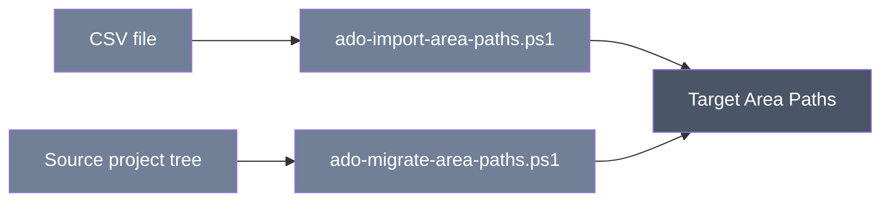

<div align="center">

# Azure DevOps Area Path Import and Migration

**Additive PowerShell scripts that create missing Area Path nodes — either from a CSV you provide, or copied from another project's live tree.**


</div>

## Table of Contents

- [Using the tool](#using-the-tool)
- [Technical reference](#technical-reference)
  - [Scripts, capabilities, and exclusions](#scripts-capabilities-and-exclusions)
  - [Prerequisites](#prerequisites)
  - [Authentication and minimum PAT scopes](#authentication-and-minimum-pat-scopes)
  - [Safety and rerun behavior](#safety-and-rerun-behavior)
  - [Parameters and precedence](#parameters-and-precedence)
  - [Input formats](#input-formats)
  - [Outputs and logs](#outputs-and-logs)
  - [Detailed workflow and behavior](#detailed-workflow-and-behavior)
  - [Verification checklist](#verification-checklist)
  - [Troubleshooting](#troubleshooting)
  - [Limitations](#limitations)
  - [Security](#security)
  - [Related workflows](#related-workflows)

---

## Using the tool

**What it does:** Builds out the Area Path hierarchy (the tree of areas used to classify work items) in a target project. It only ever adds nodes that don't already exist — it never renames, moves, or deletes anything.

There are two ways to use it:

- **Import from CSV** — you supply a spreadsheet-style file describing the area hierarchy you want, and the script creates whatever is missing in the target project.
- **Migrate from another project** — the script reads the live Area Path tree from a source project and recreates the missing branches in a target project.

**When you'd use it:** Setting up a new project and want its Area Paths to match an existing structure (from a template CSV or from another live project) without manually clicking through Project Settings one node at a time.



**What to have ready before starting:**

- For CSV import: the organization name, the target project name, a PAT with read/write access to work items on the target project, and a CSV file listing the areas you want (see the example format below).
- For project-to-project migration: source and target organization/project names, a PAT for the source with read access, and a PAT for the target with read/write access.

Example CSV format (a minimal one — headers must match exactly):

```csv
Name,AreaPath,ParentPath,Level
Target Project,Target Project,,0
Finance,Finance,Target Project,1
Ledger,Finance\Ledger,Finance,2
```

**How to run it:**

```powershell
# Preview what would be created — nothing is written yet.
./ado-import-area-paths.ps1 `
  -Organization 'contoso' -Project 'Target Project' `
  -CsvFile './AreaPaths.csv' -WhatIf

# Actually create the missing areas.
./ado-import-area-paths.ps1 `
  -Organization 'contoso' -Project 'Target Project' `
  -CsvFile './AreaPaths.csv'

# Or, copy Area Paths from one project straight into another.
./ado-migrate-area-paths.ps1 `
  -SourceOrganization 'source' -SourceProject 'Source Project' `
  -TargetOrganization 'target' -TargetProject 'Target Project' `
  -SourcePat $sourcePat -TargetPat $targetPat -NonInteractive
```

> [!TIP]
> Run with `-WhatIf` first. It reports exactly what would be created without writing anything, so you can catch a root mismatch or unexpected node before it happens.

**What to expect as output:** Console progress showing which areas were created and which already existed and were skipped. Each run also writes a log file recording what happened. No new file or transformed spreadsheet is produced.

> [!NOTE]
> **What it will NOT do:**
> - It will not update, rename, move, or delete any existing Area Path node — only add ones that are missing.
> - It will not migrate team assignments, security settings, or work items tied to those areas.
> - It will not copy target-only nodes back to the source, or touch anything outside the Area Path tree.
> - Previewing a run does not prove the target already matches — it only reports what would be created.

## Technical reference

### Scripts, capabilities, and exclusions

<details>
<summary><strong>Scripts, capabilities, and exclusions</strong> — capability and exclusions per script</summary>

| Script | Capability | Exclusions |
| --- | --- | --- |
| `ado-import-area-paths.ps1` | Validates a CSV hierarchy and creates missing nodes parent-first. | Does not update, move, rename, delete, or assign teams to existing nodes. |
| `ado-migrate-area-paths.ps1` | Reads a source tree and creates its missing relative paths in a target project. | Does not migrate team assignments, security, work items, or target-only nodes. |

</details>

### Prerequisites

- Windows PowerShell 5.1 or PowerShell 7+.
- Import: Work Items Read & write on the target project.
- Migration: Work Items Read on source and Read & write on target.
- A valid CSV for import; no workbook is required.

### Authentication and minimum PAT scopes

Import uses `Pat` → `ADO_PAT` → `Azure DevOps PAT (input hidden)`. Migration uses `SourcePat` → `ADO_SOURCE_PAT` → `Source Azure DevOps PAT (input hidden)` and the equivalent target chain/prompt. Organization parameters accept a name or full URL; migration uses the exact shared source/target organization prompts when omitted. Project prompts are `Source project name` and `Target project name`. `-NonInteractive` fails on every missing interactive value. PATs are `SecureString`, registered for redaction, and never cached.

### Safety and rerun behavior

Both scripts GET the current tree, create only absent relative paths, leave matching/target-only nodes unchanged, and never call DELETE. Reruns normally skip already-created paths; they do not prove existing nodes have equivalent permissions or team assignments. Concurrent changes can still conflict.

Both support `-WhatIf`/`-Confirm`. Under `-WhatIf`, proposed writes are reported and post-write verification is explicitly skipped because no writes occurred. A preview is not a live target-equivalence check.

### Parameters and precedence

<details>
<summary><strong>Parameters and precedence</strong> — flags for both scripts</summary>

| Script | Parameters |
| --- | --- |
| Import | Mandatory `Organization`, `Project`, `CsvFile`; optional `Pat`, `LogDirectory`, `NonInteractive`; common `WhatIf`/`Confirm`. |
| Migration | `SourceOrganization`, `SourceProject`, `SourcePat`, `TargetOrganization`, `TargetProject`, `TargetPat`, `LogDirectory`, `NonInteractive`; common `WhatIf`/`Confirm`. Missing non-secret values prompt. |

Explicit parameters win. PAT precedence is SecureString → role environment variable → hidden prompt. `LogDirectory` defaults to `logs` beside the script.

</details>

### Input formats

CSV requires headers `Name,AreaPath,ParentPath,Level` and exactly one level-0 row matching the live project root with blank `ParentPath`:

```csv
Name,AreaPath,ParentPath,Level
Target Project,Target Project,,0
Finance,Finance,Target Project,1
Ledger,Finance\Ledger,Finance,2
```

Paths are relative to the project root. The importer rejects empty data, missing headers, duplicates, malformed levels/segments, and parent/name inconsistencies before writes. Implied missing parents are created.

### Outputs and logs

The scripts print create/skip/preview progress and a final outcome; they do not generate a transformed hierarchy file. Each run creates UTF-8-without-BOM JSONL files named `<script-base>-success log-<run-id>.jsonl` and `<script-base>-error log-<run-id>.jsonl` under `LogDirectory` or local `logs`.

Each JSONL record contains `timestampUtc`, `level`, `script`, `runId`, `operation`, `outcome`, `target`, `message`, `errorType`, and `statusCode`. Both files are created even if one stays empty; secret/authorization values are redacted.

### Detailed workflow and behavior

<details>
<summary>Per-script step-by-step behavior</summary>

Import validates its local file, reads the live root/tree, validates the declared root against it, expands requested parents, sorts by depth, checks each relative path, and POSTs only missing nodes approved by `ShouldProcess`. Migration flattens both live trees, maps source-relative paths under the target root, and applies missing nodes parent-first.

After actual writes, each script freshly reads the target tree and throws if any requested/source relative path is absent. This check verifies path presence only—not security, team mappings, or other metadata.

</details>

### Verification checklist

<details>
<summary>Before and after a live run</summary>

- Run both repository offline commands.
- Preview and review every proposed path.
- Confirm the CSV root equals the actual target project root.
- After apply, inspect both JSONL logs and representative nested paths in Azure DevOps.
- Verify team Area Path settings/security separately.

Offline tests make no live calls; they verify preview/read-back code paths and local contracts, not service permissions or a real hierarchy.

</details>

### Troubleshooting

<details>
<summary>Common errors and what they mean</summary>

- Root mismatch: change the CSV level-0 row to the live project root.
- Parent/name error: use relative `AreaPath` values and a parent path consistent with the path segments.
- `401`/`403`: verify PAT scope plus project classification-node permission.
- Preview shows nothing: nodes may already exist; existing metadata is not compared.
- Read-back failure: inspect the error log and live tree, correct the permission/concurrency issue, then rerun.

</details>

### Limitations

Only node paths are migrated. Existing nodes are not reconciled, and team assignments, permissions, default area settings, work-item classification values, and deletes are out of scope. The read-back is scoped to presence, and no live validation is claimed.

### Security

> [!WARNING]
> Use least-privilege short-lived PATs and protect CSV/log data. Never embed PATs in CSV, commands, scripts, or source control.

### Related workflows

Run after [work item type migration](../ado-migrate-workitemtype/README.md) and before [dashboard query migration](../ado-dashboard-migration/README.md). Pair with [Iteration Path migration](../ado-import-iterations/README.md); the dashboard repair step is narrower than this full-tree workflow.
