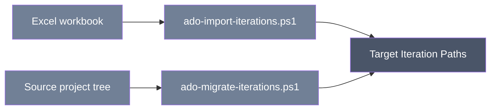

<div align="center">

# Azure DevOps Iteration Path Import and Migration

**Additive PowerShell scripts that create missing Iteration Path nodes (and their sprint dates) — either from an Excel workbook you provide, or copied from another project's live tree.**


</div>

## Table of Contents

- [Using the tool](#using-the-tool)
- [Technical reference](#technical-reference)
  - [Scripts, capabilities, and exclusions](#scripts-capabilities-and-exclusions)
  - [Prerequisites](#prerequisites)
  - [Authentication and minimum PAT scopes](#authentication-and-minimum-pat-scopes)
  - [Safety and rerun behavior](#safety-and-rerun-behavior)
  - [Parameters and precedence](#parameters-and-precedence)
  - [Input formats](#input-formats)
  - [Outputs and logs](#outputs-and-logs)
  - [Detailed workflow and behavior](#detailed-workflow-and-behavior)
  - [Verification checklist](#verification-checklist)
  - [Troubleshooting](#troubleshooting)
  - [Limitations](#limitations)
  - [Security](#security)
  - [Related workflows](#related-workflows)

---

## Using the tool

**What it does:** Builds out the Iteration Path hierarchy (the sprint/release structure used to schedule work items) in a target project, including start/finish dates where available. It only ever adds nodes that don't already exist — it never updates, deletes, or renames anything.

There are two ways to use it:

- **Import from Excel** — you supply a workbook listing the iterations you want (with optional start/finish dates), and the script creates whatever is missing in the target project. By default it just previews; you explicitly tell it to apply the changes.
- **Migrate from another project** — the script reads the live Iteration Path tree (and dates) from a source project and recreates the missing branches, with their dates, in a target project.



> [!NOTE]
> This repository does not ship a ready-made iteration workbook or template — you supply your own `.xlsx` file matching the format described below.

**When you'd use it:** Setting up a new project and want its sprint/release calendar to match an existing plan (from a workbook or from another live project) without manually creating each iteration in Project Settings.

**What to have ready before starting:**

- For workbook import: the organization name, target project name, a PAT with read/write access to work items on the target project, and a real `.xlsx` file (not a CSV renamed to `.xlsx`) with an `Iterations` worksheet.
- For project-to-project migration: source and target organization/project names, a PAT for the source with read access, and a PAT for the target with read/write access.

Your workbook's `Iterations` sheet needs these column headers somewhere in row A–D: `Parent Path`, `Iteration Name`, `Start Date`, `Finish Date`. Dates should be plain text in `yyyy-MM-dd` format (not Excel date-serial values or formulas).

**How to run it:**

```powershell
# Preview the workbook — nothing is written yet.
./ado-import-iterations.ps1 `
  -Organization 'contoso' -Project 'Target Project' `
  -ExcelFile './MyIterations.xlsx'

# Apply — actually create the missing iterations.
./ado-import-iterations.ps1 `
  -Organization 'contoso' -Project 'Target Project' `
  -ExcelFile './MyIterations.xlsx' -Apply

# Or, copy iterations and dates from one project straight into another.
./ado-migrate-iterations.ps1 `
  -SourceOrganization 'source' -SourceProject 'Source Project' `
  -TargetOrganization 'target' -TargetProject 'Target Project' `
  -SourcePat $sourcePat -TargetPat $targetPat -NonInteractive
```

> [!TIP]
> The importer previews by default — nothing is created until you add `-Apply`. Review the console output first.

**What to expect as output:** Console progress showing which iterations were created (with dates, if supplied) and which were already present and skipped. Each run also writes a log file. No workbook or transformed hierarchy file is produced.

> [!NOTE]
> **What it will NOT do:**
> - It will not update dates or any other detail on an iteration that already exists — existing nodes are left alone entirely.
> - It will not delete or rename anything, and migration won't touch iterations that only exist in the target.
> - It will not configure a team's sprint selections or capacity — that's a separate step in Azure DevOps.
> - It does not read Excel formulas or serial date values — dates must be plain text in the documented format.

## Technical reference

### Scripts, capabilities, and exclusions

<details>
<summary><strong>Scripts, capabilities, and exclusions</strong> — capability and exclusions per script</summary>

| Script | Capability | Exclusions |
| --- | --- | --- |
| `ado-import-iterations.ps1` | Validates an `Iterations` worksheet, previews by default, and creates missing nodes/dates with `-Apply`. | Does not update existing nodes; `-UpdateExisting` is rejected before authentication or API calls. |
| `ado-migrate-iterations.ps1` | Copies missing relative paths and source start/finish dates into a target project. | Does not update existing target dates, delete target-only nodes, or configure team sprint selections/capacity. |

The repository does **not** contain an iteration workbook/template. Supply your own `.xlsx` matching the schema below; filenames shown in examples are illustrative only.

</details>

### Prerequisites

- Windows PowerShell 5.1 or PowerShell 7+.
- Import: Work Items Read & write on target. Migration: Work Items Read on source and Read & write on target.
- A real XLSX (ZIP/XML Office Open XML), not CSV renamed to `.xlsx`.
- No Excel, COM, Python, or third-party PowerShell module is required.

### Authentication and minimum PAT scopes

Import uses `Pat` → `ADO_PAT` → `Azure DevOps PAT (input hidden)`. Migration uses `SourcePat`/`ADO_SOURCE_PAT`/`Source Azure DevOps PAT (input hidden)` and the target equivalents. Missing migration organizations use the exact shared source/target organization prompts; project prompts are `Source project name` and `Target project name`. `-NonInteractive` fails rather than prompting. PATs are `SecureString` and are not cached.

### Safety and rerun behavior

The importer is preview-only unless `-Apply`; `-WhatIf` can additionally suppress writes. Migration supports `-WhatIf`/`-Confirm`. Both create only absent nodes and never delete. Existing path/date metadata is skipped, not compared or updated, so "safe to rerun" means no duplicate path creation—not full equivalence.

Migration performs a fresh path-presence read-back only after real writes. Under `-WhatIf`, it explicitly skips post-write verification because nothing was written. Import preview reports a preview outcome; it does not assert target changes.

### Parameters and precedence

<details>
<summary><strong>Parameters and precedence</strong> — flags for both scripts</summary>

| Script | Parameters |
| --- | --- |
| Import | Mandatory `Organization`, `Project`, `ExcelFile`; `Apply`, unsupported `UpdateExisting`, `Pat`, `LogDirectory`, `NonInteractive`; common `WhatIf`/`Confirm`. |
| Migration | `SourceOrganization`, `SourceProject`, `SourcePat`, `TargetOrganization`, `TargetProject`, `TargetPat`, `LogDirectory`, `NonInteractive`; common `WhatIf`/`Confirm`. |

Explicit values win; PAT precedence is SecureString → environment → hidden prompt. `UpdateExisting` always terminates before credentials/network activity because updating dates is not implemented safely.

</details>

### Input formats

The workbook must contain a worksheet named `Iterations`. Somewhere in that sheet it must have the header cells `Parent Path`, `Iteration Name`, `Start Date`, `Finish Date` in columns A–D. Subsequent data rows use:

| Column | Format |
| --- | --- |
| Parent Path | Blank for top level or backslash-delimited relative parent, such as `Release 1`. |
| Iteration Name | Required single segment; no backslash. |
| Start Date | Optional exact `yyyy-MM-dd`. |
| Finish Date | Optional exact `yyyy-MM-dd`, not before start. |

The reader supports shared strings and inline strings. It rejects missing sheet/header/data, blank names, malformed paths/dates, and duplicate relative paths. It is intentionally not a general Excel formula/date-serial evaluator; store the dates as visible text in the documented format.

### Outputs and logs

Scripts print `CREATE`/`SKIP`, counts, and preview/apply outcome. They do not create a workbook or transformed hierarchy export.

Every run creates UTF-8-without-BOM JSONL files named `<script-base>-success log-<run-id>.jsonl` and `<script-base>-error log-<run-id>.jsonl` under `LogDirectory` or local `logs`. Records contain `timestampUtc`, `level`, `script`, `runId`, `operation`, `outcome`, `target`, `message`, `errorType`, and `statusCode`; secrets are redacted.

### Detailed workflow and behavior

<details>
<summary>Per-script step-by-step behavior</summary>

Import reads/validates the worksheet, obtains the live iteration tree, expands implied parents, and orders missing nodes by depth. With `Apply` and `ShouldProcess` approval, it POSTs each node and assigns documented dates when that path has a source row. Existing leaves are reported as skipped.

Migration flattens source/target trees, maps source-relative paths below the target root, copies source date attributes on newly created nodes, and re-reads the target after writes. Its verification checks path presence; it does not compare dates on existing nodes or team sprint configuration.

</details>

### Verification checklist

<details>
<summary>Before and after a live run</summary>

- Run both offline verification commands.
- Confirm there is no claimed checked-in template; inspect your workbook sheet/header/date text.
- Run import without `Apply` or migration with `-WhatIf` first.
- After apply, review both JSONL logs and representative nested paths/dates.
- Separately verify team iteration selections, capacities, and existing-node dates.

Offline checks use local/static coverage without live Azure DevOps calls.

</details>

### Troubleshooting

<details>
<summary>Common errors and what they mean</summary>

- Worksheet/header missing: use exact `Iterations` and the four documented headers in A–D.
- Date invalid: store text as `yyyy-MM-dd`; avoid formulas or locale-formatted serial cells.
- `UpdateExisting` error: remove the switch; modify existing dates manually or with another reviewed tool.
- `401`/`403`: verify PAT scopes and classification-node permission.
- Read-back failure: inspect live target state/concurrent changes, then rerun; already-created paths will be skipped.

</details>

### Limitations

No workbook is supplied. Existing dates are never reconciled. Team iteration settings, capacities, permissions, work-item assignments, deletes, and renames are out of scope. Path-presence read-back and offline tests do not prove complete sprint configuration or live service correctness.

### Security

> [!WARNING]
> Use least-privilege short-lived PATs. Workbooks and logs can disclose release calendars and project structure; store them securely and never embed credentials.

### Related workflows

Pair with [Area Path migration](../ado-import-area-paths/README.md), run after [work item type migration](../ado-migrate-workitemtype/README.md), and before [dashboard query migration](../ado-dashboard-migration/README.md).
