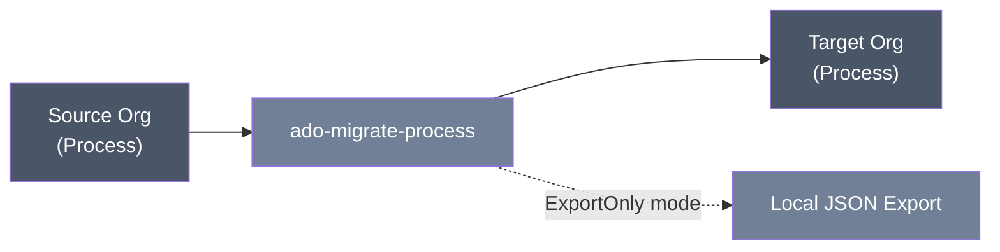

<div align="center">

# Azure DevOps Process Migration

**Migrates an entire Azure DevOps inherited process — work item types, fields, picklists, states, rules, and layout — from one organization to another.**


</div>

## Table of Contents

- [Using the tool](#using-the-tool)
- [Technical reference](#technical-reference)
  - [Scripts, capabilities, and exclusions](#scripts-capabilities-and-exclusions)
  - [Three process-migration modes (-ProcessMode)](#three-process-migration-modes--processmode)
  - [Prerequisites](#prerequisites)
  - [Authentication and minimum PAT scopes](#authentication-and-minimum-pat-scopes)
  - [Safety and rerun behavior](#safety-and-rerun-behavior)
  - [Quick start](#quick-start)
  - [Parameters and precedence](#parameters-and-precedence)
  - [Input formats](#input-formats)
  - [Outputs and logs](#outputs-and-logs)
  - [Detailed workflow and behavior](#detailed-workflow-and-behavior)
  - [Verification checklist](#verification-checklist)
  - [Troubleshooting](#troubleshooting)
  - [Limitations](#limitations)
  - [Security](#security)

---

## Using the tool

**What it does.** This script copies a custom ("inherited") Azure DevOps process — the work item types, fields, picklists, states, rules, and form layouts that make it up — from a source organization to a target organization. It's a metadata copy, not a full clone: it does not migrate actual work items, projects, permissions, or backlog behavior settings.



**When you'd use it.** You're standing up a new Azure DevOps organization (or a new process within one) and want it to start with the same custom process definition as an existing one, instead of rebuilding it by hand.

**What to have ready before starting:**
- The exact name of the source process (as it appears in Organization Settings > Process).
- The name you want the target process to have (it will be created if it doesn't already exist).
- The source and target organization names or URLs.
- A Personal Access Token (PAT) for the source org with Process and Work Items **read** access.
- A PAT for the target org with Process and Work Items **read and write** access. Depending on what you're migrating, the account behind that PAT may also need Project Collection Administrator-level permissions in the target org.
- A decision on which of the three modes below fits your situation (see "Choosing a mode").

**Choosing a mode.** Azure DevOps doesn't have an API to switch an *existing* project onto a different process — that has to be done by hand in the web UI. It does have an API to create a *brand-new* project already on a given process. The script offers three modes to work around this:

- **AssistedManual (the default).** The script creates the process in the target org, then checks whether your target project already exists and is on the right process. If everything lines up, it runs the full migration automatically. If the project doesn't exist yet, or exists but is on the wrong process, it stops and tells you exactly what to do manually in the Azure DevOps UI (switch the project to the new process, or create the project). Once you've done that, run the script again with the same parameters — it will detect things are now correct and carry on. If you don't specify a target project at all, this check is skipped and the migration just runs.
- **FullAuto.** Use this only when you have API permission to create projects in the target organization. The script creates the process, creates a brand-new project on that process (private, Git-based — these aren't configurable), and runs the full migration in one go, with no manual step in between. If you run it again and the project already exists, it behaves like AssistedManual from that point.
- **ExportOnly.** Use this when you don't have API access to the target organization at all — for example, when the target is managed by a customer's own admin. The script reads the source process and writes it out to a local file that you hand off to whoever administers the target org. It makes no calls to the target organization whatsoever.

**How to run it — a basic example:**

```powershell
./ado-migrate-process.ps1 `
  -SourceOrganization 'source-org' -SourceProcess 'My Custom Process' `
  -TargetOrganization 'target-org' -TargetProcess 'My Custom Process Copy'
```

Run this from a PowerShell prompt in the script's folder. If you don't supply PATs on the command line, the script will prompt you for them (input is hidden). For an export-only handoff where you have no target org access, add `-ProcessMode ExportOnly`.

**What to expect.** The script prints progress as it works — what it created, what it skipped because it already existed, and any warnings about things it couldn't fully translate (for example, a rule that depends on something not present in the target). At the end you get a summary count of what was migrated. It also writes log files you can review later. Nothing is deleted at any point, in either organization.

> [!WARNING]
> **What it will NOT do:**
> - It will not copy actual work items, projects, or process permissions.
> - It will not switch an existing project onto a new process for you (only FullAuto creates a *new* project already on the right process; existing projects need the manual UI step described above).
> - It will not preserve every nuance of complex rules or custom UI extensions — those are flagged as warnings for you to handle by hand.
> - It has no "undo" — there's no dry-run or rollback. Try it against a nonproduction organization first.
> - It will not tell you the target process behaves identically to the source; you still need to spot-check it (see the [verification checklist](#verification-checklist) in the technical section).

---

## Technical reference

### Scripts, capabilities, and exclusions

The script creates the target process (if needed), then migrates work item types (both custom and inherited), organization-level fields, picklists, WIT field settings, custom states, state visibility rules, custom rules, and form layout controls.

It does not migrate backlog behavior assignments, extension-contribution controls, process permissions, projects, work items, process description beyond basic metadata, or deletions. Rules whose dependencies cannot be reconciled are warned and skipped.

### Three process-migration modes (`-ProcessMode`)

Azure DevOps has no REST API to switch an **existing** project's process --
only its web UI can do that (Organization Settings > Process > select the
process > Projects tab). It *does*, however, support creating a **brand-new**
project already on a given process via the API. Real engagements vary in how
much API access the customer grants, so `-ProcessMode` selects one of three
behaviors:

<details>
<summary><strong>Full mode reference</strong> — AssistedManual, FullAuto, ExportOnly behavior and exit codes</summary>

- **`AssistedManual`** (default): creates/verifies the process via API, then
  checks `-TargetProject`. If the project doesn't exist yet, or exists but is
  on a different process, the script prints the exact manual step needed and
  stops -- it exits with code `3` rather than throwing, since this is an
  expected pause, not a failure. Do the manual step, then run the script again
  with the same parameters; it detects the project is now correct and
  proceeds with the full migration. Without `-TargetProject`, this check is
  skipped entirely and the full migration always runs.
- **`FullAuto`**: creates the process via API, then also creates a brand-new
  project (`-TargetProject`, required in this mode) already on that process
  via the API -- private visibility, Git version control, not configurable --
  and continues straight into the full WIT/field/state/rule/layout migration
  in the same run, no manual step needed. Only use this when the customer has
  granted API access to create projects in their target organization. If the
  project already exists (e.g. a rerun after a prior partial `FullAuto` run),
  it falls back to the same check-and-continue behavior as `AssistedManual`.
- **`ExportOnly`**: makes **zero API calls to the target organization at
  all**. Reads the source process definition and writes it to a local JSON
  file (`process-export-<name>-<timestamp>.json` under `-LogDirectory`) for
  hand-off to the customer's own Azure DevOps admin, who recreates the
  process (and the project) themselves. Exits with code `4` -- there is
  nothing to rerun in this same session; a fresh run happens later once the
  customer's project exists. `-TargetOrganization`/`-TargetPat` are still
  requested (the parameter set doesn't change per mode) but are not used for
  anything in this mode.

</details>

> [!NOTE]
> `AssistedManual` and `FullAuto` can pause mid-run rather than fail: exit code `3` means "waiting on a manual UI step, rerun after you've done it." `ExportOnly` always exits `4` — there is nothing to rerun until the target admin has recreated the process on their end.

### Prerequisites

- Windows PowerShell 5.1 or PowerShell 7+.
- Source: Process Read and Work Items Read.
- Target: Process Read & write and Work Items Read & write.
- Target organization must allow process creation; creating organization-level fields requires Project Collection Administrator permission or equivalent process permissions.

### Authentication and minimum PAT scopes

`SourcePat` resolves from SecureString → `ADO_SOURCE_PAT` → `Source Azure DevOps PAT (input hidden)`. Target uses its equivalent chain and prompt. Organization prompts are the exact shared source/target organization strings. Other exact prompts are `SOURCE process name` and `TARGET process name (will be created if it does not exist)`. `-NonInteractive` fails rather than prompting. PATs are not cached or written to disk.

### Safety and rerun behavior

The script issues GET/POST/PATCH/PUT operations and no DELETE. It reuses many name/reference matches, patches field settings, and warns about failures rather than stopping. Reruns are intended to converge on supported metadata, but not every object is deeply compared and rule/layout reconciliation is best-effort; review warnings and target content after every run.

> [!WARNING]
> There is no `-WhatIf`, preview, rollback, or transaction. Use a nonproduction target organization first.

<details>
<summary><strong>Why <code>Set-StrictMode -Off</code> is explicit</strong> — a launcher-only failure mode this avoids</summary>

The script explicitly sets `Set-StrictMode -Off` at the top rather than relying on PowerShell's own default. `Set-StrictMode` is inherited from the caller's scope, and `ado-project-setup-runner.ps1` (the [ado-project-setup](../ado-project-setup/README.md) launcher) sets `-Version Latest` at its own script scope before invoking this script in the same process; without the explicit override here, this script would silently run under StrictMode when launched through the launcher but not when run standalone, producing launcher-only failures that could not be reproduced from a plain PowerShell prompt or a static read of the code. The explicit `-Off` makes this script's behavior identical regardless of how it is invoked.

</details>

### Quick start

```powershell
./ado-migrate-process.ps1 `
  -SourceOrganization 'source-org' -SourceProcess 'My Custom Process' `
  -TargetOrganization 'target-org' -TargetProcess 'My Custom Process Copy'
```

<details>
<summary>Unattended and export-only examples</summary>

Unattended:

```powershell
./ado-migrate-process.ps1 `
  -SourceOrganization 'source-org' -SourceProcess 'My Custom Process' -SourcePat $sourcePat `
  -TargetOrganization 'target-org' -TargetProcess 'My Custom Process Copy' -TargetPat $targetPat `
  -LogDirectory './run-logs' -NonInteractive
```

Export-only, no target organization access needed:

```powershell
./ado-migrate-process.ps1 `
  -SourceOrganization 'source-org' -SourceProcess 'My Custom Process' -SourcePat $sourcePat `
  -ProcessMode ExportOnly -LogDirectory './run-logs' -NonInteractive
```

</details>

### Parameters and precedence

<details>
<summary><strong>Full parameter reference</strong></summary>

| Parameter | Description |
| --- | --- |
| `SourceOrganization` / `TargetOrganization` | Bare organization name or supported Azure DevOps URL. |
| `SourceProcess` | Exact source process display name. |
| `TargetProcess` | Exact target process display name (will be created if missing). |
| `TargetProject` | Optional for `AssistedManual`/`ExportOnly`; required for `FullAuto` (the project to check/create). |
| `ProcessMode` | `FullAuto`, `AssistedManual` (default), or `ExportOnly` -- see above. |
| `SourcePat` / `TargetPat` | Role-specific `SecureString` PATs. |
| `LogDirectory` | Shared JSONL directory; defaults to `logs` beside the script. |
| `NonInteractive` | Rejects all missing interactive input. |

Explicit non-secret parameters precede prompts. PAT precedence is SecureString → environment → prompt. No same-organization PAT-reuse question exists in the current code; supply the same SecureString explicitly to both parameters if migrating within one organization.

</details>

### Input formats

Names are plain PowerShell strings and are matched against live organization/process metadata. Organization accepts `contoso`, `https://dev.azure.com/contoso`, or legacy organization URL form. The script has no input CSV/JSON workbook; source process APIs are authoritative.

### Outputs and logs

Console output reports `[OK]`, `[SKIP]`, `[WARN]`, and summary totals for WITs, picklists, fields, states, rules, and layout controls. No migration package or rollback file is produced.

Each run creates UTF-8-without-BOM JSONL files named `<script-base>-success log-<run-id>.jsonl` and `<script-base>-error log-<run-id>.jsonl` under `LogDirectory` or local `logs` (the script base is `ado-migrate-process`). Records contain `timestampUtc`, `level`, `script`, `runId`, `operation`, `outcome`, `target`, `message`, `errorType`, and `statusCode`; PAT/authorization values are redacted.

### Detailed workflow and behavior

<details>
<summary>Step-by-step behavior</summary>

The script resolves source/target organizations and source process, then creates or reuses the target process. It enumerates and creates picklists, then organization-level fields. For each work item type in the source process, it creates or updates the WIT in the target, attaches or patches fields, creates custom states, hides inherited states that were hidden in source, creates rules where dependencies exist, and adds missing layout controls.

Warnings are expected for unsupported extension controls, target-only content, or rule dependencies that cannot be translated. A final success means the implemented calls completed; it is not a full semantic comparison of process behavior.

</details>

### Verification checklist

<details>
<summary>Before and after a live run</summary>

- Run both offline repository verification commands.
- Confirm source and target organization/process names before execution.
- Review every warning and summary count.
- In the target organization, open the process and inspect:
  - All work item types are present
  - Custom fields and picklists exist
  - Field settings (required/read-only/default) match source
  - States are correctly created and hidden states match source
  - Rules are present (check for skipped rules in logs)
  - Form layouts show all custom fields
- Create representative test work items and exercise state/rule behavior manually.
- Verify backlog behavior assignments separately.

Offline checks make no live calls and cannot prove process permissions, UI rendering, or rule semantics.

</details>

### Troubleshooting

<details>
<summary>Common errors and what they mean</summary>

- Target organization doesn't allow process creation: verify your permissions or ask an administrator to create an empty inherited process first.
- Field/picklist creation forbidden: verify target PAT scope and collection-level process permissions.
- Rule skipped: create/map the referenced identity, field, state, or group and rerun, then inspect duplicates.
- Layout warning: extension controls are unsupported; configure them manually.
- WIT creation failed: the target process may already have a conflicting WIT; check manually.
- `401`/`403`: verify PAT organization/expiry/scope and the user's process administration permission.

</details>

### Limitations

This is a selective best-effort process migration, not a full clone. It lacks rollback/dry run, does not migrate behaviors or extension controls, and does not prove semantic equivalence. The target process is created from a default parent (Agile preferred) if it doesn't exist, which may differ from the source process's parent. Concurrent changes and target customizations can require manual resolution. No live validation is claimed.

### Security

> [!WARNING]
> PATs are handled as SecureString parameters and are not written to disk or console. All log output redacts authorization headers and PAT values. Environment variables (`ADO_SOURCE_PAT`, `ADO_TARGET_PAT`) are marked sensitive when discovered. Follow your organization's credential management policies.
