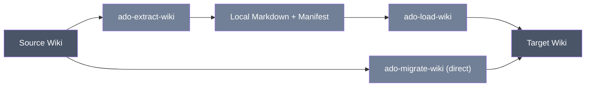

<div align="center">

# Azure DevOps Wiki Tools

**Three PowerShell scripts that copy Azure DevOps wiki content between projects/organizations — either directly, or through a validated local export/load pair.**


</div>

## Table of Contents

- [Using the tool](#using-the-tool)
- [Technical reference](#technical-reference)
  - [Scripts, capabilities, and exclusions](#scripts-capabilities-and-exclusions)
  - [Prerequisites](#prerequisites)
  - [Authentication and minimum PAT scopes](#authentication-and-minimum-pat-scopes)
  - [Safety and rerun behavior](#safety-and-rerun-behavior)
  - [Quick start](#quick-start)
  - [Parameters and precedence](#parameters-and-precedence)
  - [Input formats](#input-formats)
  - [Outputs and logs](#outputs-and-logs)
  - [Detailed workflow and behavior](#detailed-workflow-and-behavior)
  - [Verification checklist](#verification-checklist)
  - [Troubleshooting](#troubleshooting)
  - [Limitations](#limitations)
  - [Security](#security)
  - [Related workflows](#related-workflows)

---

## Using the tool

**What these do.** There are three related scripts here, all for moving Azure DevOps wiki content between projects/organizations:

- **`ado-extract-wiki.ps1`** — exports a wiki's pages to Markdown files on your local disk, plus a manifest file that records what was exported.
- **`ado-load-wiki.ps1`** — takes a previously exported folder and loads those pages into a target project's wiki.
- **`ado-migrate-wiki.ps1`** — copies a wiki directly from a source project to a target project in one step (no local export folder involved), including the attachments and page-ordering the pages reference.



**When you'd use each one:**
- Use **extract + load** when you want a local, reviewable copy of the wiki content in between (for example, to inspect, archive, or hand off the Markdown files before loading them somewhere), or when you're not doing a live source-to-target run in one sitting.
- Use **migrate (direct)** when you just want to copy a wiki from one project to another in a single step, including its attachments and page ordering.

**What none of these will do:**
- Copy the wiki's Git commit history, authors, or timestamps.
- Copy page permissions or comments.
- Copy deleted pages.
- Delete anything in the target — existing target-only pages are always left alone.
- Copy unreferenced attachment files (only attachments actually referenced by a page are copied, and only by the direct migration script — extract/load don't touch attachments at all).

**What to have ready before starting:**
- Source organization and project name, and the wiki name (if the project has more than one wiki, you'll need to specify which one).
- Target organization and project name, and the wiki name you want to use there.
- A PAT for the source with Code/Wiki **read** access.
- A PAT for the target with Code/Wiki **read and write** access. If the target project doesn't have a wiki yet, the account also needs permission to create one.

**How to run it — a basic example for each script:**

```powershell
# Export a wiki to local Markdown files
./ado-extract-wiki.ps1 `
  -Organization 'source-org' -Project 'Source Project' `
  -WikiName 'Source Project.wiki' -OutputPath './wiki-export'

# Load a previously exported wiki into a target project
./ado-load-wiki.ps1 `
  -SourcePath './wiki-export/Source Project.wiki' `
  -Organization 'target-org' -Project 'Target Project'

# Or copy a wiki directly, source to target, in one step
./ado-migrate-wiki.ps1 `
  -SourceOrganization 'source-org' -SourceProject 'Source Project' `
  -SourceWikiName 'Source Project.wiki' `
  -TargetOrganization 'target-org' -TargetProject 'Target Project' `
  -TargetWikiName 'Target Project.wiki'
```

Run whichever script fits your case from a PowerShell prompt in this folder. If you don't pass PATs on the command line, you'll be prompted for them (input is hidden).

**What to expect as output.** Extract writes a folder of Markdown files plus a manifest file describing what it exported. Load and direct migration don't write local content — they write directly to the target wiki and print progress to the console as they go (what was created, what was already up to date and skipped, and any warnings). Every run also writes log files you can review afterward, and the direct migration script additionally writes a plain-text log of every step it took.

> [!TIP]
> A page that's already identical in the target is left alone (not re-written). A page that differs is updated — but if someone else changed that page in the target since you last touched it, the script will flag a conflict rather than blindly overwriting their edit.

---

## Technical reference

### Scripts, capabilities, and exclusions

<details>
<summary><strong>Capability and exclusions per script</strong></summary>

| Script | Capability | Exclusions |
| --- | --- | --- |
| `ado-extract-wiki.ps1` | Exports one/all visible wikis to UTF-8 Markdown plus a SHA-256 manifest. | Does not export attachments, Git history, permissions, revisions, or `.order` files. |
| `ado-load-wiki.ps1` | Validates one manifest-backed export, creates/reuses a project wiki, and creates/updates pages. | Does not load attachments or accept edited files whose hashes disagree. |
| `ado-migrate-wiki.ps1` | Directly copies pages, referenced relative `.attachments/...` files, and (by default) sibling page order (`.order` files). | Does not copy unreferenced binaries, history, permissions, comments, or deleted pages. Page-order sync can be turned off with `-SkipPageOrder`. |

The synthetic `/` root is excluded. Target-only pages are retained; none of these scripts deletes pages.

</details>

### Prerequisites

- Windows PowerShell 5.1 or PowerShell 7+.
- Source project/wiki (Code/Wiki) Read; target project metadata and Code/Wiki Read & write.
- Permission to create a project wiki if the target has none.
- Sufficient local disk/access controls for exports.

### Authentication and minimum PAT scopes

Extract uses `SourcePat` → `ADO_SOURCE_PAT` → `Source Azure DevOps PAT (input hidden)`. Load uses the target equivalents. Direct migration resolves both independently. Missing organizations use the exact shared source/target organization prompts; project prompts are `Source project name`, `Source project name or ID`, or `Target project name or ID` as used by each entry script. `-NonInteractive` rejects missing input. PATs are not cached or stored in manifests/logs.

<details>
<summary><strong>PAT scope reference</strong> — minimum source/target scope for wiki migration</summary>

Use source Project/team metadata and Code/Wiki Read, and target Project/team metadata plus Code/Wiki Read & write. Creating a project wiki can require additional project repository administration permission beyond PAT scope.

</details>

### Safety and rerun behavior

Missing pages are created. Existing pages with byte-identical content are skipped. Non-identical matching pages are updated with the current ETag; a concurrent edit causes a conflict rather than an unconditional overwrite. Target-only pages remain. Direct migration skips an already-identical attachment and otherwise writes the referenced attachment; strict missing-attachment validation can fail before page writes. After pages are written, direct migration also skips an already-identical `.order` file and otherwise writes the source one; this step runs last because a child page's parent folder does not exist in the target repository until that child page has been created.

> [!WARNING]
> These scripts have no `-WhatIf`. `-NoExecute` only loads functions and records a preview outcome for offline testing; it does not inspect or preview a remote migration. Repeatability does not mean rollback or preservation of target edits: non-identical matching pages are intentionally replaced.

### Quick start

```powershell
./ado-extract-wiki.ps1 `
  -Organization 'source-org' -Project 'Source Project' `
  -WikiName 'Source Project.wiki' -OutputPath './wiki-export'

./ado-load-wiki.ps1 `
  -SourcePath './wiki-export/Source Project.wiki' `
  -Organization 'target-org' -Project 'Target Project'

./ado-migrate-wiki.ps1 `
  -SourceOrganization 'source-org' -SourceProject 'Source Project' `
  -SourceWikiName 'Source Project.wiki' `
  -TargetOrganization 'target-org' -TargetProject 'Target Project' `
  -TargetWikiName 'Target Project.wiki'
```

### Parameters and precedence

<details>
<summary><strong>Full parameter reference</strong> — parameters per script</summary>

| Script | Parameters |
| --- | --- |
| Extract | `Organization`, `Project`, `WikiName`, `OutputPath`, `NoExecute`, `SourcePat`, `LogDirectory`, `NonInteractive`. |
| Load | `SourcePath`, `Organization`, `Project`, `NoExecute`, `TargetPat`, `ApiBaseUri` (default `https://dev.azure.com`, test seam), common logging switches. |
| Direct | `SourceOrganization`, `SourceProject`, `SourceWikiName`, `TargetOrganization`, `TargetProject`, `TargetWikiName`, `ApiBaseUri`, `AllowMissingAttachments`, `StrictAttachmentValidation`, `SkipPageOrder`, `NoExecute`, source/target PATs, common logging switches. |

Explicit parameters precede prompts; PAT precedence is SecureString → environment → prompt. Extract defaults to all visible wikis and a timestamped `WikiExport_<project>_<timestamp>` directory. Multiple source wikis require an explicit name for direct migration. Load accepts a wiki folder or a parent containing exactly one manifest. `StrictAttachmentValidation` overrides the default/explicit allowance of missing attachments. `SkipPageOrder` opts out of the default sibling-order (`.order` file) sync that direct migration otherwise performs after all pages are written.

</details>

### Input formats

Each extracted wiki folder contains Markdown files and `wiki-export-manifest.json`. The manifest records source organization/project/wiki identity/type, declared page count, and per-page wiki path, relative filename, content length, SHA-256, order value, and Git item path. Local names are made Windows-safe; the manifest remains authoritative.

Load rejects missing/multiple manifests, duplicate wiki paths, count mismatch, path traversal/out-of-root resolution, missing files, and SHA-256/content-length mismatch before target API writes. A source path pasted with matching surrounding quotes is normalized. Direct migration reads live page trees/content and `.attachments/...` references; absolute/source-specific Markdown links are copied as written.

### Outputs and logs

Extract writes one subdirectory per selected wiki with Markdown and manifest files, using UTF-8 without BOM. Load/direct write no local content export.

Every run creates JSONL files named `<script-base>-success log-<run-id>.jsonl` and `<script-base>-error log-<run-id>.jsonl` in `LogDirectory` or local `logs`, UTF-8 without BOM. Records contain `timestampUtc`, `level`, `script`, `runId`, `operation`, `outcome`, `target`, `message`, `errorType`, and `statusCode`; registered secrets and authorization/query-token values are redacted.

<details>
<summary><strong>Direct migration's secondary log</strong> — the plain-text step log and its path history</summary>

`ado-migrate-wiki.ps1` additionally writes a human-readable `WikiMigration_<yyyyMMdd_HHmmss>.log` (UTF-8, one line per step, mirrored to the console) resolved from `-LogDirectory` when supplied.

> [!NOTE]
> Earlier versions wrote this file to the process's current directory, which failed when the script was launched from a directory the process couldn't write to (for example when invoked from `ado-project-setup`'s `ado-migrate://` protocol handler, which can start the process rooted in `C:\Windows\System32`); when `-LogDirectory` is passed explicitly — as the launcher always does — this log now lands there instead. When `-LogDirectory` is omitted entirely (a standalone run with no other flags), this file's default directory is one level above the JSONL logs' own default (a `logs` folder beside the repository root rather than beside the script); pass `-LogDirectory` explicitly to keep both together.

Extract and load do not write this secondary log.

</details>

### Detailed workflow and behavior

<details>
<summary>Per-script step-by-step behavior</summary>

Extract discovers wiki/page trees recursively, requests each page body separately, maps paths to collision-safe local files, computes SHA-256, and writes the manifest only with the collected records. Case-insensitive local path collisions terminate the run rather than overwrite content.

Load fully validates local data before connecting, resolves/creates a project wiki, processes parents before children, skips identical content, sends ETag-protected updates for differences, then freshly reads each written page and compares content/hash.

Direct migration resolves source/target projects/wikis, recursively reads pages, optionally validates all referenced attachments before target page writes, copies or skips attachments, creates/updates pages parent-first, and freshly compares target page content. By default a missing referenced attachment is warned/skipped; `StrictAttachmentValidation` makes it fatal before page writes. After all pages are created and validated, it copies each directory's `.order` file (the sibling drag-and-drop ordering the wiki UI stores in the wiki's backing Git repo, not in the Wiki Pages API) from source to target verbatim, skipping directories with no custom order and identical existing files; `-SkipPageOrder` disables this step. Attachment, page, and order-file writes are all read back and byte/hash-compared against the source before being counted as successful.

</details>

### Verification checklist

<details>
<summary>Before and after a live run</summary>

- Run both repository offline commands.
- Inspect export manifest counts and hashes before transfer.
- Test load/direct migration in a nonproduction project.
- Review both JSONL logs, missing-attachment warnings, and every updated page path.
- Compare representative rendered Markdown, links, images, hierarchy, and target-only content manually.
- For direct migration, review the `.order` sync summary (directories checked/synced/identical) in the console output and log; for extract/load, verify navigation ordering separately since neither carries `.order` files.
- Verify repository/wiki permissions separately in all cases.

Offline tests exercise manifest/path/hash, API-base seam, identical skip, attachment, failure, and representative read-back behavior without live Azure DevOps calls.

</details>

### Troubleshooting

<details>
<summary>Common errors and what they mean</summary>

- Multiple source wikis: pass `SourceWikiName`/`WikiName`.
- Multiple manifests: point `SourcePath` at one wiki subfolder.
- SHA-256 mismatch: restore/regenerate the export; manual Markdown edits are intentionally rejected.
- ETag conflict: inspect the concurrent target change and decide whether overwriting on rerun is intended.
- Missing attachment: fix the source reference or run without strict validation if skipping is acceptable.
- `401`/`403`: verify PAT organization/scope plus wiki/repository permissions.
- Read-back mismatch: inspect normalization/service behavior for the reported path; success is not recorded for that item.

</details>

### Limitations

No workflow migrates Git history, authors/timestamps, revisions, permissions, comments, deleted pages, or target-only cleanup. Extract/load omit `.order` files and all attachments entirely; direct migration includes referenced relative `.attachments/...` paths and, unless `-SkipPageOrder` is used, each directory's `.order` file. Absolute links remain source-specific. No live validation is claimed.

### Security

> [!WARNING]
> Use short-lived least-privilege PATs. Treat Markdown, manifests, attachments, logs, and page paths as sensitive. Keep exports access-controlled, do not embed PATs, and securely remove temporary exports when organizational policy requires it.

### Related workflows

Run after target process/structure and [dashboard migration](../ado-dashboard-migration/README.md) so copied links can be reviewed against final destinations. See the [root workflow](../README.md) for ordering.
