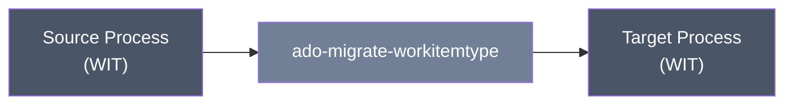

<div align="center">

# Azure DevOps Work Item Type Migration

**Migrates one inherited-process work item type — fields, states, best-effort rules, and form placement — between processes in the same or different organizations.**


</div>

## Table of Contents

- [Using the tool](#using-the-tool)
- [Technical reference](#technical-reference)
  - [Scripts, capabilities, and exclusions](#scripts-capabilities-and-exclusions)
  - [Prerequisites](#prerequisites)
  - [Authentication and minimum PAT scopes](#authentication-and-minimum-pat-scopes)
  - [Safety and rerun behavior](#safety-and-rerun-behavior)
  - [Quick start](#quick-start)
  - [Parameters and precedence](#parameters-and-precedence)
  - [Input formats](#input-formats)
  - [Outputs and logs](#outputs-and-logs)
  - [Detailed workflow and behavior](#detailed-workflow-and-behavior)
  - [Verification checklist](#verification-checklist)
  - [Troubleshooting](#troubleshooting)
  - [Limitations](#limitations)
  - [Security](#security)
  - [Related workflows](#related-workflows)

---

## Using the tool

**What it does.** This script copies a single work item type — say, a custom "Business Process" type — from one inherited process to another, including its fields, picklists, states, best-effort rules, and where those fields sit on the form. It's narrower than the full process migration tool: instead of copying an entire process, it copies one work item type out of a source process into a target process.



**When you'd use it.** You've already got a target process set up (or you're adding a new type to an existing one) and just need to bring over one specific work item type from another process, rather than migrating the whole process.

**What to have ready before starting:**
- The exact name of the work item type as it appears in the source process (for example, "Business Process").
- The exact name of the source process and the target process.
- The target process must already exist and must be an inherited (customizable) process — this tool doesn't create processes, only work item types within one.
- Source and target organization names or URLs (can be the same organization or different ones).
- A PAT for the source with Process and Work Items **read** access.
- A PAT for the target with Process and Work Items **read and write** access. Depending on what's being migrated, the target account may also need collection-administrator-level permissions.

**How to run it — a basic example:**

```powershell
./ado-migrate-workitemtype.ps1 `
  -WorkItemTypeName 'Business Process' `
  -SourceOrganization 'source-org' -SourceProcess 'Source Inherited Process' `
  -TargetOrganization 'target-org' -TargetProcess 'Target Inherited Process'
```

Run this from a PowerShell prompt in the script's folder. If you don't pass PATs on the command line, you'll be prompted for them (input is hidden), along with the work item type name if you didn't supply it.

**What to expect.** The script prints progress as it goes — fields, picklists, states, rules, and layout controls it created, reused, or skipped, plus warnings for anything it couldn't fully translate (such as a rule referencing something that doesn't exist in the target). At the end you get a summary count. It also writes log files for later review. Nothing is deleted in either organization.

> [!WARNING]
> **What it will NOT do:**
> - It will not migrate the rest of the process — only the one work item type you name.
> - It will not migrate actual work items, projects, or process permissions.
> - It will not migrate backlog behavior assignments or custom UI extension controls.
> - It has no undo — no dry-run or rollback. Try it against a nonproduction process first.
> - It will not confirm the target behaves identically to the source; plan to spot-check the result (see the [verification checklist](#verification-checklist) in the technical section).

> [!IMPORTANT]
> This tool modifies the **target process** directly — new fields, states, rules, and layout controls are added to whatever work item type already exists there (or a newly created one). Run against a nonproduction process first if you're unsure what will be created.

---

## Technical reference

### Scripts, capabilities, and exclusions

<details>
<summary><strong>Capability and exclusions</strong></summary>

The script creates or derives the WIT, reuses/creates picklists and organization fields, attaches/patches WIT field settings, creates custom states, hides inherited states hidden at source, creates best-effort rules, and creates missing layout pages/groups/controls.

It does not migrate backlog behavior assignments, extension-contribution controls, general system-process content, process permissions, projects, work items, or deletions. Rules whose identities/fields/states cannot be reconciled are warned/skipped.

</details>

### Prerequisites

- Windows PowerShell 5.1 or PowerShell 7+.
- Source: Process Read and Work Items Read.
- Target: Process Read & write and Work Items Read & write.
- Target must be an inherited process; modifying organization fields can require collection-administrator/equivalent process permissions.

### Authentication and minimum PAT scopes

`SourcePat` resolves from SecureString → `ADO_SOURCE_PAT` → `Source Azure DevOps PAT (input hidden)`. Target uses its equivalent chain and prompt. Organization prompts are the exact shared source/target organization strings. Other exact prompts are `Work Item Type name (as shown in the process, e.g. "Business Process")`, `SOURCE process name`, and `TARGET process name`. `-NonInteractive` fails rather than prompting. PATs are not cached or written to disk.

### Safety and rerun behavior

The script issues GET/POST/PATCH/PUT operations and no DELETE. It reuses many name/reference matches, patches field settings, and warns about target-only states rather than removing them. Reruns are intended to converge on supported metadata, but not every object is deeply compared and rule/layout reconciliation is best-effort; review warnings and target content after every run.

> [!WARNING]
> There is no `-WhatIf`, preview, rollback, or transaction. Use a nonproduction inherited process first.

### Quick start

```powershell
./ado-migrate-workitemtype.ps1 `
  -WorkItemTypeName 'Business Process' `
  -SourceOrganization 'source-org' -SourceProcess 'Source Inherited Process' `
  -TargetOrganization 'target-org' -TargetProcess 'Target Inherited Process'
```

<details>
<summary>Unattended example</summary>

```powershell
./ado-migrate-workitemtype.ps1 `
  -WorkItemTypeName 'Business Process' `
  -SourceOrganization 'source-org' -SourceProcess 'Source Inherited Process' -SourcePat $sourcePat `
  -TargetOrganization 'target-org' -TargetProcess 'Target Inherited Process' -TargetPat $targetPat `
  -LogDirectory './run-logs' -NonInteractive
```

</details>

### Parameters and precedence

<details>
<summary><strong>Full parameter reference</strong></summary>

| Parameter | Description |
| --- | --- |
| `WorkItemTypeName` | Source display name; prompts when blank. |
| `SourceOrganization` / `TargetOrganization` | Bare organization name or supported Azure DevOps URL. |
| `SourceProcess` / `TargetProcess` | Exact process display names. Target must be inherited. |
| `SourcePat` / `TargetPat` | Role-specific `SecureString` PATs. |
| `LogDirectory` | Shared JSONL directory; defaults to `logs` beside the script. |
| `NonInteractive` | Rejects all missing interactive input. |

Explicit non-secret parameters precede prompts. PAT precedence is SecureString → environment → prompt. No same-organization PAT-reuse question exists in the current code; supply the same SecureString explicitly to both parameters if appropriate.

</details>

### Input formats

Names are plain PowerShell strings and are matched against live organization/process/WIT metadata. Organization accepts `contoso`, `https://dev.azure.com/contoso`, or legacy organization URL form. The script has no input CSV/JSON workbook; source process APIs are authoritative.

### Outputs and logs

Console output reports `[OK]`, `[SKIP]`, `[WARN]`, and stage totals for picklists, fields, states, rules, and layout controls. No migration package or rollback file is produced.

Each run creates UTF-8-without-BOM JSONL files named `<script-base>-success log-<run-id>.jsonl` and `<script-base>-error log-<run-id>.jsonl` under `LogDirectory` or local `logs` (the script base is `ado-migrate-workitemtype`). Records contain `timestampUtc`, `level`, `script`, `runId`, `operation`, `outcome`, `target`, `message`, `errorType`, and `statusCode`; PAT/authorization values are redacted.

### Detailed workflow and behavior

<details>
<summary>Step-by-step behavior</summary>

The script resolves source/target processes and source WIT, verifies the target process is customizable, and creates/derives or reuses the target WIT. It enumerates source fields, recreates/reuses picklists and organization fields, then attaches or patches WIT field attributes. It reconciles custom/hidden states, translates and creates rules where dependencies exist, and creates missing layout containers/controls for migrated fields.

Warnings are expected for unsupported extension controls, target-only content, or rule dependencies that cannot be translated. A final success means the implemented calls completed; it is not a full semantic comparison of process behavior.

</details>

### Verification checklist

<details>
<summary>Before and after a live run</summary>

- Run both offline repository verification commands.
- Confirm source and target process/WIT names and target inheritance before execution.
- Review every warning and summary count.
- In the target UI, inspect fields/picklists, required/read-only/default settings, state visibility, rules, and every form page/group/control.
- Create representative test work items and exercise rule/state behavior manually.
- Verify backlog behavior assignments separately.

Offline checks make no live calls and cannot prove process permissions, UI rendering, or rule semantics.

</details>

### Troubleshooting

<details>
<summary>Common errors and what they mean</summary>

- Target system process: create/select an inherited process.
- Field/picklist creation forbidden: verify target PAT scope and collection-level process permissions.
- Rule skipped: create/map the referenced identity, field, state, or group and rerun, then inspect duplicates.
- Layout warning: extension controls are unsupported; configure them manually.
- `401`/`403`: verify PAT organization/expiry/scope and the user's process administration permission.

</details>

### Limitations

This is a selective best-effort WIT migration, not a process clone. It lacks rollback/dry run, does not migrate behaviors or extension controls, and does not prove semantic equivalence. Concurrent changes and target customizations can require manual resolution. No live validation is claimed.

### Security

> [!WARNING]
> Use short-lived least-privilege PATs. Process definitions can expose internal business rules, field names, identities, and groups; protect logs and console captures. Never put PATs in source control or plain-text parameters.

### Related workflows

Use [field extraction](../ado-field-extraction/README.md) for planning. Migrate WITs before [Area/Iteration structure](../ado-import-area-paths/README.md) and [dashboard queries](../ado-dashboard-migration/README.md); see the [root workflow](../README.md).
