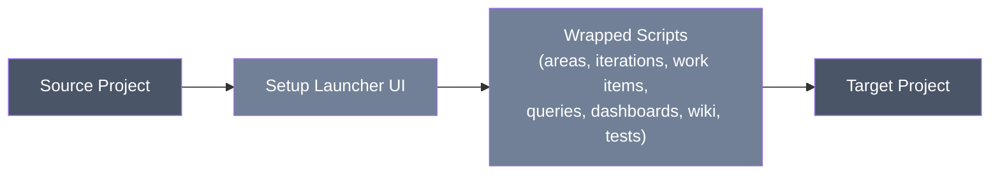

<div align="center">

# Azure DevOps Project Setup Launcher

**A guided WPF launcher that click-through drives this repo's migration scripts to stand up a new Azure DevOps target project from a source project.**


</div>

`ado-project-setup` wraps the other scripts in this repo (area/iteration paths, work items, queries, dashboards, wiki, test management, and optionally process migration) behind a single guided flow, so a person doing the migration clicks through a few screens instead of running each script by hand. There are two ways to run it, covered separately below: an **Azure Pipeline** (recommended — centrally versioned, no local install) and a **legacy WPF desktop app** (kept working as a fallback).

The pipeline runs from a self-contained copy of just the scripts it needs, at [`../ado-migration`](../ado-migration) — a duplicate of the runner, the shared module, and the wrapped step scripts, kept in sync by hand with their originals at the repo root. The repo root copies are unchanged and remain the ones an admin runs individually by hand; see [Pipeline (recommended)](#pipeline-recommended) below for why the two trees exist and how to keep them in sync.

This README has two parts:

- **Using the tool** — for someone who just wants to run a migration through the UI.
- **Technical reference** — parameters, scopes, file layout, and direct script invocation, for anyone maintaining or scripting around the launcher.

## Table of Contents

- [Using the tool](#using-the-tool)
  - [What you're running](#what-youre-running)
  - [Before you start](#before-you-start)
  - [Opening the launcher](#opening-the-launcher)
  - [Step 1: Connect](#step-1-connect)
  - [Step 2: Choose steps](#step-2-choose-steps)
  - [Step 3: Run](#step-3-run)
  - [Step 4: Done](#step-4-done)
  - [What happens with the process step's results](#what-happens-with-the-process-steps-results)
  - [What this tool does NOT do](#what-this-tool-does-not-do)
  - [Output](#output)
- [Technical reference](#technical-reference)
  - [Scripts, capabilities, and exclusions](#scripts-capabilities-and-exclusions)
  - [Step catalog and invocation order](#step-catalog-and-invocation-order)
  - [`ado-project-setup-runner.ps1` parameters](#ado-project-setup-runnerps1-parameters)
  - [Authentication and PAT handling](#authentication-and-pat-handling)
  - [Logs and outputs](#logs-and-outputs)
  - [Resume state (work items and test management)](#resume-state-work-items-and-test-management)
  - [Crash handling and log integrity](#crash-handling-and-log-integrity)
  - [Pipeline (recommended)](#pipeline-recommended)
  - [Protocol installation (legacy)](#protocol-installation-legacy)
  - [Bookmark HTML (legacy)](#bookmark-html-legacy)
  - [Direct script invocation (bypassing the UI)](#direct-script-invocation-bypassing-the-ui)
  - [Safety and rerun behavior](#safety-and-rerun-behavior)
  - [Process mismatch is the most common source of partial results](#process-mismatch-is-the-most-common-source-of-partial-results)
  - [Verification](#verification)

---

## Using the tool



### What you're running

Clicking the launch link opens a small Windows desktop window (built with WPF) on the machine where the tool is installed. It walks you through four screens: **Connect**, **Choose Steps**, **Run**, and **Done**. Behind the scenes it runs the other PowerShell scripts in this repo in order, one per selected step, and shows you live progress as each one completes.

### Before you start

Have ready:

- The source project URL, in the form `https://dev.azure.com/{org}/{project}`.
- The target project URL, in the same form.
- A Personal Access Token (PAT) for the source organization, and a PAT for the target organization.
- If you also want to migrate the process template (Step 0): the process name, and a decision on which of the three process migration modes to use (see below).

The target project normally needs to already exist and be on the process template you want before you start. The one exception is Step 0's "Full automation" mode, which will create the process and the target project for you — see below.

### Opening the launcher

**Recommended: the Azure Pipeline.** Open the bookmarked (or Teams-pinned) link to the pipeline's run page, click **Run pipeline**, fill in the target project URL and paste the target PAT into the masked field, and go — no local install, no per-machine setup. See [Pipeline (recommended)](#pipeline-recommended) in the Technical Reference for the full parameter list, where logs land, and how to register the pipeline against a template project.

**Legacy fallback: the WPF desktop app.** The tool can still be opened through a link that launches a local Windows app instead. Someone with access to a Windows PowerShell session first needs to register the `ado-migrate://` link type on your machine (a one-time setup step — ask whoever maintains this tool if that hasn't been done yet). Once that's done, clicking a link such as:

```
ado-migrate://open
```

— for example, from the bookmarkable landing page (`launch.html` in this folder) — opens the launcher window directly. No console window appears. See [Protocol installation (legacy)](#protocol-installation-legacy) and [Bookmark HTML (legacy)](#bookmark-html-legacy) for setup details.

### Step 1: Connect

Enter:

- Source project URL and source PAT.
- Target project URL and target PAT.
- Optionally, a process name and a process migration mode, if you plan to migrate the process template as part of this run (Step 0 below).

The tool checks both URLs and PATs before letting you continue, so a bad token or a typo in the project name is caught immediately rather than partway through a run.

> [!NOTE]
> PATs are entered as masked password fields, held in memory only for the session, and are never written to disk, to the command line, or into any log or config file.

If you provided a process name, the process migration mode controls what Step 0 will do:

- **Full automation** (the default selection) — creates the process and then creates the target project itself via the Azure DevOps API, then continues straight into the rest of the run. Use this only if you have API permission to create projects in the target organization.
- **Process now, project later** — creates the process, then stops and asks you (or your Azure DevOps admin) to create or switch the target project by hand, since there's no API for that. You come back and rerun Step 0 once that's done.
- **Export process only** — makes no changes in the target organization at all. It writes the process definition to a file you can hand off to the customer's own Azure DevOps admin. The run ends there, since nothing else can proceed without a target project.

### Step 2: Choose steps

Pick which steps to run, in a checklist. They always run in a fixed order regardless of the order you check them:

0. Migrate Process Template (optional — work item types, fields, picklists, states, rules, layout)
1. Set target team default area (with sub-areas included)
2. Copy Iteration Paths
3. Copy Area Paths
4. Copy all Work Items
5. Copy Shared Queries (folders and queries)
6. Copy Dashboards
7. Copy Wiki pages, subpages, and referenced images
8. Copy Test Plans, Suites & Test Cases

Steps 1–5 are checked by default; steps 0, 6, 7, and 8 are opt-in. You can select any combination — for example, just Wiki and Dashboards on a rerun.

### Step 3: Run

Once you click "Run selected steps," the launcher runs each one in sequence and updates its status live: pending, running, succeeded, failed, or (for the process step) an in-between "action needed" or "exported" state. Each step shows a short status message; clicking the colored dot next to a step opens that step's log file.

> [!WARNING]
> Don't close the window while a run is in progress — you can cancel the remaining steps instead if needed.

### Step 4: Done

When the run finishes you get a summary screen: an overall banner (success, action needed, exported, or failed) plus a per-step result list, each with a link to its log. From here you can open the folder containing all the logs for that run, rerun just the steps that failed, or start a fresh run.

### What happens with the process step's results

If you selected Step 0 with "Process now, project later" or "Export process only," the run stops in a non-failure state rather than continuing:

- "Process now, project later" shows an amber "action needed" banner — a person needs to create or switch the target project in Azure DevOps, after which you rerun Step 0 to pick up where it left off.
- "Export process only" shows a blue "process exported" banner — the process file has been written for hand-off, and there's nothing left to resume in this run. Use "Start New Run" to begin again once the target project exists.

> [!NOTE]
> Neither of these is treated as a failure.

### What this tool does NOT do

> [!WARNING]
> - It does not migrate permissions or security groups.
> - It does not store, log, or otherwise persist your PATs anywhere.
> - It does not decide where the final production copy of this tool (the HTML page and scripts) should be hosted — that's a separate decision for whoever owns this deployment.
> - It does not create the target project for you, unless you specifically chose Step 0's "Full automation" mode. Otherwise, the target project must already exist before you start.
> - It does not migrate full work item history, every identity mapping, or organization-level extensions, and it has no rollback — a partially completed run is not automatically undone.
> - If the target project uses a different process template than the source, content that depends on custom types or fields (work items of a missing type, queries referencing a missing field, dashboard widgets bound to those queries) is skipped rather than copied, and reported as such. See the Technical Reference section for how to avoid this.

### Output

Every run creates a timestamped folder under your Documents folder containing a plain-text log per activity you ran, plus a machine-readable progress feed and end-of-run summary. See [Logs and outputs](#logs-and-outputs) in the Technical Reference below for the exact layout.

---

## Technical reference

### Scripts, capabilities, and exclusions

<details>
<summary><strong>Script reference</strong> — the files that make up this tool</summary>

| Script | Capability | Exclusions |
| --- | --- | --- |
| `azure-pipelines.yml` | Pipeline definition for the recommended, centrally-run path. Duplicated at `../ado-migration/ado-project-setup/azure-pipelines.yml`, with each copy's script paths pointing at its own tree. See [Pipeline (recommended)](#pipeline-recommended). | Does not store PATs; target PAT is a queue-time-only secret. |
| `ado-project-setup-runner.ps1` | Runs selected setup steps in the prescribed order and writes PC-facing logs. Duplicated byte-for-byte at `../ado-migration/ado-project-setup/ado-project-setup-runner.ps1` for the pipeline to run from. | Does not create the target project (unless Step 0's "Full automation" mode is used), migrate permissions, or provide rollback. |
| `ado-project-setup-ui.ps1` | Local WPF interface launched directly or through `ado-migrate://open`. | Legacy path, superseded by the Azure Pipeline; kept as a manual fallback. Does not store PATs or host the bookmark page. |
| `install-ado-migrate-protocol.ps1` | Registers the Windows `ado-migrate://` protocol to open the local UI. | Legacy path, superseded by the Azure Pipeline; kept as a manual fallback. Does not deploy the final HTML/script hosting location. |
| `launch.html` | Static bookmarkable landing page with the `ado-migrate://open` launch link, styled to match the WPF UI. | Legacy path, superseded by the Azure Pipeline; kept as a manual fallback. Does not collect PATs or run anything itself. |

The final home for `launch.html` and the legacy scripts, if kept long-term, must be determined and locked before Production. Prototype locations are development-only. The pipeline path has no equivalent open question — its home is `../ado-migration`, checked out from the mirrored Azure Repos copy of this repo (see [Pipeline (recommended)](#pipeline-recommended)).

</details>

### Step catalog and invocation order

The runner (`ado-project-setup-runner.ps1`) sorts whatever steps it's given into this fixed order, regardless of the order they're passed in:

<details open>
<summary><strong>Step catalog</strong> — the nine steps and the scripts each one wraps</summary>

| # | Step id | Wrapped script(s) |
| --- | --- | --- |
| 0 | `process` | `ado-migrate-process/ado-migrate-process.ps1` |
| 1 | `team-config` | `ado-set-default-area/ado-set-default-area.ps1` |
| 2 | `iterations` | `ado-import-iterations/ado-migrate-iterations.ps1` |
| 3 | `areas` | `ado-import-area-paths/ado-migrate-area-paths.ps1` |
| 4 | `work-items` | `ado-copy-all-workitems/ado-copy-all-workitems.ps1` |
| 5 | `queries` | Shared Queries copy logic, implemented directly in the runner (`Copy-SharedQueries`) |
| 6 | `dashboards` | `ado-dashboard-migration/01-export-dashboards.ps1`, `02-migrate-queries.ps1`, `03-import-dashboards.ps1` (run in sequence) |
| 7 | `wiki` | `ado-migrate-wiki/ado-migrate-wiki.ps1` (see [ado-migrate-wiki](../ado-migrate-wiki/README.md) for sibling page ordering) |
| 8 | `test-management` | `ado-copy-test-management/ado-copy-test-management.ps1` |

</details>

Notes on individual steps:

- **Step 0 (process)** requires `-ProcessName`. Depending on `-ProcessMode`, the wrapped script exits with a code the runner interprets specially: exit `3` (AssistedManual) marks the step `degraded` and stops the run — a person needs to create/switch the target project, then Step 0 is rerun to finish. Exit `4` (ExportOnly) marks the step `exported` and stops the run — nothing else in that run can proceed since no target project exists yet. Any other selected steps are skipped (not failed) once a run hits `degraded` or `exported`.
- **Step 1 (team-config)** resolves the target team name automatically: it looks for a team matching the project name or `"{project} Team"`, or falls back to the only team present, and throws if it can't determine one. The area path defaults to the target project name if `-DefaultAreaPath` isn't supplied.
- **Step 4 (work-items)** discovers work items via WIQL against the source rather than creating a saved query there, so the source PAT only ever needs read access.
- **Step 5 (queries)** copies the full Shared Queries folder hierarchy (fetched two levels of `$depth` at a time, since the Queries API caps `$depth` at 2, with deeper folders fetched on demand). Only the source project name inside each query's WIQL is rewritten to the target project name — Area/Iteration paths inside the WIQL are left untouched, since silently redirecting another project's paths would change what the query means. Queries that fail because the target is missing a referenced field, type, or classification path (ADO error codes TF51011, TF51005, TF212023, or a generic "does not exist"/"could not be found") are reported as **process skips**, not failures, and do not stop the run. Queries that fail for any other reason (for example, a 403 permission error) are treated as real failures and do stop the run.
- **Step 6 (dashboards)** exports from source, migrates the underlying queries, then imports into target — three separate scripts chained in one step, writing to a `dashboard-export` subfolder of the run directory. Dashboard widgets are rewired to target IDs; Test Plan-based chart widgets are not rewired automatically (see Step 8).
- **Step 7 (wiki)** accepts optional `-SourceWikiName` / `-TargetWikiName` overrides, passed through only if supplied in the Connect screen.
- **Step 8 (test-management)** is additive and resumable. Run it before repointing any Test Plan-based dashboard chart widgets, since those are not rewired automatically by Step 6.

### `ado-project-setup-runner.ps1` parameters

<details>
<summary><strong>Full parameter reference</strong> — every runner parameter, type, and default</summary>

| Parameter | Type | Default | Notes |
| --- | --- | --- | --- |
| `-SourceProjectUrl` | string | prompted if omitted (non-interactive UI runs always pass it) | `https://dev.azure.com/{org}/{project}` |
| `-TargetProjectUrl` | string | prompted if omitted | Same format |
| `-Steps` | string[] | `team-config, iterations, areas, work-items, queries, dashboards, wiki, test-management` | Accepts a real array from a session, or a single comma-delimited string (required when invoked via `powershell.exe -File`, since that host can't bind more than one value to a `[string[]]` parameter). Steps run in catalog order regardless of the order supplied. Unknown step ids throw. |
| `-ProcessName` | string | none | Required if `process` is among the selected steps. |
| `-ProcessMode` | string (`FullAuto`, `AssistedManual`, `ExportOnly`) | `AssistedManual` | Note: the UI's Connect screen preselects **Full automation** as its radio-button default (changed in the August 2026 brand restyle) — this is a UI-only default. The parameter's own default when the runner is invoked directly is `AssistedManual`. |
| `-DefaultAreaPath` | string | target project name | Used by the `team-config` step. |
| `-SourceWikiName` | string | none (auto-detected by the wiki script) | Passed through only if supplied. |
| `-TargetWikiName` | string | none (auto-detected) | Passed through only if supplied. |
| `-RunRoot` | string | `%USERPROFILE%\Documents\AdoMigrationLogs\<target-org>_<target-project>\<yyyyMMdd-HHmmss>\` | Where this run's logs and exports are written. Independent of the resume-state location (see below). |
| `-ProgressPath` | string | `<RunRoot>\progress.jsonl` | Machine-readable progress feed the UI polls. |
| `-SourcePat` | SecureString | resolved interactively / from environment if omitted | See Authentication below. |
| `-TargetPat` | SecureString | resolved interactively / from environment if omitted | See Authentication below. |
| `-NonInteractive` | switch | off | Set by the UI on every run it launches; suppresses interactive prompts. |

</details>

### Authentication and PAT handling

The UI collects PATs as password fields, then passes them to the child runner process through process environment variables (`ADO_SOURCE_PAT` / `ADO_TARGET_PAT`) for that single process launch, and clears those variables from its own process immediately after starting the runner. The runner and every wrapped entry script consume the PATs as `SecureString` and pass them onward the same way — since the runner invokes each wrapped script in-process (`& $command`, not a new process), `SecureString` values survive the call intact.

> [!NOTE]
> PATs are never written to the HTML page, config, command line, logs, or state files. The runner also seeds a local text redactor (`$script:LocalSecrets`) with the plaintext PAT values so that if the shared `AdoUtils.Common` module is briefly unloaded during a child script's `Import-Module -Force`, log lines are still scrubbed of the raw token, `Authorization` headers, and common `?token=`/`?pat=`-style query parameters.

<details>
<summary><strong>Minimum PAT scopes</strong> — by role and step</summary>

Minimum scopes depend on selected steps:

- **Source:** Work Items Read, Process Read (for Step 0), Team Dashboards Read, Code/Wiki Read, Test Management Read (for Step 8), Project/team metadata Read.
- **Target:** Work Items Read & write, Process Read & write (for Step 0), Team Dashboards Manage, Code/Wiki Read & write, Test Management Read & write (for Step 8), Project/team metadata Read, and permission to update Team Settings.

Step 0 (process migration) additionally requires Process Read & write scopes and Project Collection Administrator permission (or equivalent process permissions) in the target organization, to create organization-level fields — this applies to the "Full automation" and "Process now, project later" modes. "Export process only" makes no target-organization calls for Step 0 and needs no target write scopes for it; note that any other selected steps are skipped in that same run, since no target project exists yet.

The source PAT genuinely needs only read scopes: Step 4 discovers work items with WIQL through `ado-copy-all-workitems`, so nothing is created in the source project.

</details>

Before the Connect screen advances to Choose Steps, the UI independently verifies both PATs against their respective project URLs (`Test-AdoProjectAccess`), so a wrong credential is caught immediately rather than partway through a run. If a process name was supplied (meaning Step 0 may run), a 404 on the target project is tolerated and instead re-checked at the organization level (`Test-AdoOrgAccess`, hitting the Projects - List endpoint) — since FullAuto and the project-missing sub-case of AssistedManual both expect the target project not to exist yet.

### Logs and outputs

Default run root:

```text
%USERPROFILE%\Documents\AdoMigrationLogs\<target-org>_<target-project>\<yyyyMMdd-HHmmss>\
```

Each selected activity writes a PC-facing text log named:

```text
<target-org>_<target-project> <activity>.log
```

<details>
<summary><strong>Runner-level outputs</strong> — progress feed, summary, and technical logs</summary>

The runner also writes:

- `progress.jsonl` — one JSON line per status event (`pending`, `running`, `succeeded`, `failed`, `skipped`, `degraded`, `exported`), used for UI status updates.
- `summary.json` — the final run summary (source/target URLs, run directory, progress path, per-step results, and an overall `finalStatus` of `succeeded`, `failed`, `exported`, or `action-required`).
- `technical-jsonl/` — canonical ado-utils JSONL logs from each wrapped script.
- `runner-console.log` — raw stdout/stderr captured from the runner's own process, as a last-resort diagnostic if the runner crashes before writing anything else (see below).
- Step-specific export artifacts, such as `dashboard-export/` for Step 6.

</details>

### Resume state (work items and test management)

Work item and Test Management resume state is deliberately **not** per-run. It lives at:

```text
%USERPROFILE%\Documents\AdoMigrationLogs\<target-org>_<target-project>\state\workitems-state.json
%USERPROFILE%\Documents\AdoMigrationLogs\<target-org>_<target-project>\state\test-management-state.json
```

This location is independent of `-RunRoot` — even a run pointed at a scratch `RunRoot` shares resume state with every other run against the same target. Each file maps a source work item / Test Plan artifact to the target item created from it. Rerunning the work item or Test Management step reads the matching file and skips what already exists.

> [!WARNING]
> Deleting a state file makes the next run copy everything again, creating duplicates — keep it with the target project, and delete it only when starting that target over from scratch.

### Crash handling and log integrity

If the runner process itself crashes (rather than a wrapped step failing normally), two failure modes that previously produced a misleading or empty error log are handled explicitly:

<details>
<summary><strong>Crash-handling details</strong> — the two failure modes and how each is mitigated</summary>

- The launcher UI polls `progress.jsonl` roughly once a second while the runner appends to it concurrently. A transient file-sharing violation or a torn (partially written) JSON line no longer crashes the UI; that tick is skipped and the file is re-read on the next one.
- Every wrapped entry script shares the same `AdoUtils.Common.psm1` run-logging state within the runner process (since each is invoked in-process, not as a separate process), so by the time the runner's own top-level error trap fires, that shared state has usually already been marked complete by the last child script — which used to leave the runner's own crash silently unlogged (an empty error log even though the process exited non-zero). The runner now also writes its own crash record directly to its captured log-file path, independent of that shared state, and degrades field-by-field if the error object itself is non-standard (for example, one that crossed a WPF event-handler boundary) instead of masking the real failure with a property-not-found error. If the runner's own JSONL error log is still empty after a crash, `runner-console.log` in the run directory captures the raw process stdout/stderr as a last resort.

</details>

> [!WARNING]
> Do not commit generated run folders, logs, state files, or exports.

### Pipeline (recommended)

The pipeline exists to solve two problems the WPF/OneDrive-sync model had: script version drift across coordinators' machines, and no central audit trail of who ran what against which customer org. It runs centrally from Azure DevOps, versioned in this repo, so every run always executes exactly one known copy of the scripts.

<details>
<summary><strong>Why there are two copies of the scripts</strong> — <code>../ado-migration</code> vs. the repo root</summary>

This repo root stays exactly as it's always been: every script here can be run individually by hand (see [Direct script invocation](#direct-script-invocation-bypassing-the-ui)), and nothing here was moved or deleted for the pipeline to exist — including `azure-pipelines.yml` itself, which exists at the repo root too, not only under `ado-migration/`.

[`../ado-migration`](../ado-migration) is a second, self-contained copy of only the files the automated sequence needs: `AdoUtils.Common.psm1`, `ado-project-setup-runner.ps1`, `azure-pipelines.yml`, and the nine wrapped step scripts (`ado-migrate-process`, `ado-set-default-area`, `ado-import-iterations`, `ado-import-area-paths`, `ado-copy-all-workitems`, the three `ado-dashboard-migration` scripts, `ado-migrate-wiki`, `ado-copy-test-management`). The folder nesting inside `ado-migration/` mirrors the repo root exactly, so the runner's existing relative-path logic (`Join-Path $PSScriptRoot '../ado-migrate-process/...'`) works there completely unmodified.

**These are two independent, fully working copies, not a shared reference** — each tree can run this tool's automation on its own. Updating a script at the repo root does not automatically update its `ado-migration/` counterpart. After changing any of the files listed above, re-copy the changed ones into `ado-migration/` before the next pipeline run needs them:

```bash
cp AdoUtils.Common.psm1 ado-migration/AdoUtils.Common.psm1
cp ado-project-setup/ado-project-setup-runner.ps1 ado-migration/ado-project-setup/ado-project-setup-runner.ps1
cp ado-migrate-process/ado-migrate-process.ps1 ado-migration/ado-migrate-process/ado-migrate-process.ps1
cp ado-set-default-area/ado-set-default-area.ps1 ado-migration/ado-set-default-area/ado-set-default-area.ps1
cp ado-import-iterations/ado-migrate-iterations.ps1 ado-migration/ado-import-iterations/ado-migrate-iterations.ps1
cp ado-import-area-paths/ado-migrate-area-paths.ps1 ado-migration/ado-import-area-paths/ado-migrate-area-paths.ps1
cp ado-copy-all-workitems/ado-copy-all-workitems.ps1 ado-migration/ado-copy-all-workitems/ado-copy-all-workitems.ps1
cp ado-dashboard-migration/01-export-dashboards.ps1 ado-migration/ado-dashboard-migration/01-export-dashboards.ps1
cp ado-dashboard-migration/02-migrate-queries.ps1 ado-migration/ado-dashboard-migration/02-migrate-queries.ps1
cp ado-dashboard-migration/03-import-dashboards.ps1 ado-migration/ado-dashboard-migration/03-import-dashboards.ps1
cp ado-migrate-wiki/ado-migrate-wiki.ps1 ado-migration/ado-migrate-wiki/ado-migrate-wiki.ps1
cp ado-copy-test-management/ado-copy-test-management.ps1 ado-migration/ado-copy-test-management/ado-copy-test-management.ps1
```

`azure-pipelines.yml` is **not** in that plain-`cp` list on purpose: the two copies are byte-identical except for two path references (the `AdoUtils.Common.psm1` import and the runner invocation), which point at each copy's own tree — `./AdoUtils.Common.psm1` / `./ado-project-setup/ado-project-setup-runner.ps1` at the repo root, `./ado-migration/AdoUtils.Common.psm1` / `./ado-migration/ado-project-setup/ado-project-setup-runner.ps1` under `ado-migration/`. When one changes in any other way (a new parameter, a new stage), port the change by hand and keep each copy's two path references as they are.

`tests/run-offline-checks.ps1` recurses the whole repo, so it validates both copies automatically — its hardcoded entry-script count (36) already accounts for the 11 duplicated `.ps1` files in `ado-migration/`. If a script is ever added to or removed from the pipeline's file list above, that count needs updating too.

</details>

<details>
<summary><strong>Mirroring this repo into Azure Repos</strong> — Azure Pipelines needs a native Azure Repos Git source</summary>

This repo's authoritative home is GitHub. Azure Pipelines needs an Azure Repos Git source, so a mirror is kept manually — no GitHub Actions workflow, nothing automated to maintain.

**Seed the mirror (once):** in the template project → Repos → New repository → name it `ado-utils`, leave it empty (no README). From a local clone of this repo:

```bash
git remote add azure https://dev.azure.com/<org>/<project>/_git/ado-utils
git push azure --all
git push azure --tags
```

**Keep it in sync:** after pushing changes to `main` on GitHub (including any `ado-migration/` re-sync from above), run `git push azure main` from a clone with both remotes configured. Nobody commits directly into the Azure Repos copy — GitHub stays the only place these scripts are actually edited.

</details>

<details>
<summary><strong>Registering the pipeline against a template project</strong></summary>

An Azure DevOps Pipeline is project-scoped, so this repeats once per template project — see the design plan for the full "one pipeline per template project, one shared YAML file" rationale.

1. Template project → **Pipelines** → **New pipeline** → **Azure Repos Git** → select the mirrored repo.
2. **Existing Azure Pipelines YAML file** → branch `main` → path `/ado-migration/ado-project-setup/azure-pipelines.yml` → Continue.
3. On the review screen, use the Run dropdown → **Save** (register without queuing a run yet).
4. Rename the pipeline to something stable (e.g. `ado-project-setup`).
5. Edit → **Variables**: set `sourceProjectUrl`'s default to this template's known source project URL; add `TargetPat` as secret + "Settable at queue time," left blank.
6. Edit → **Variables** → **Variable groups** → link `ado-project-setup-source-credentials` (create it once under **Pipelines → Library** if it doesn't exist yet — a secret `SourcePat` variable, authorized for reuse across this org's pipelines).
7. Save.
8. Pipeline's "..." menu → **Security** → grant **Queue builds** to the coordinator group only, not the whole project.
9. Copy the pipeline's URL (`?definitionId=...`) — this is what gets bookmarked or pinned as a Teams tab.
10. Test-run against a sandbox project before handing the link to coordinators.

</details>

<details>
<summary><strong>Parameters and variables</strong></summary>

| Name | Kind | Default | Notes |
| --- | --- | --- | --- |
| `targetProjectUrl` | parameter (string) | — | The new customer's project URL. |
| `processName` | parameter (string) | `''` | Required only if the Process step is selected. |
| `processMode` | parameter (string) | `FullAuto` | `FullAuto`, `AssistedManual`, or `ExportOnly` — see the three scenarios below. |
| `stepProcess` … `stepTestManagement` | parameter (boolean, one per catalog step) | Same defaults as the WPF UI: steps 1–5 checked, 0/6/7/8 opt-in | Runner still re-sorts whatever's selected into fixed catalog order regardless of check order. |
| `defaultAreaPath`, `sourceWikiName`, `targetWikiName` | parameter (string) | `''` | Optional overrides; blank means auto-detect, same as today. |
| `sourceProjectUrl` | variable | set per pipeline registration | Not a parameter on purpose — its default lives on the Pipeline resource, so every template's registration can pre-fill its own source URL from one shared YAML file. |
| `SourcePat` | secret variable, from the `ado-project-setup-source-credentials` variable group | — | Set up once, reused by every registration. |
| `TargetPat` | secret, queue-time-settable variable, set per registration | — | Pasted in fresh each run, never stored — same trust model as the WPF password field. |

</details>

**Where results land:** the run publishes a pipeline artifact (`setup-run-<BuildId>`) containing the same per-step logs, `progress.jsonl`, and `summary.json` the WPF UI writes locally today. Check `summary.json`'s `finalStatus` for the real outcome — the runner exits `0` for `action-required`/`exported` by design (they're clean stops, not failures), so the pipeline explicitly surfaces those instead of leaving a plain green checkmark that hides them.

<details>
<summary><strong>The three <code>processMode</code> scenarios under the pipeline</strong></summary>

All three function identically to the WPF UI; only scenario 2's handoff step differs:

1. **Full automated migration (`FullAuto`)** — the pipeline's default. Creates the process and the target project via API, then runs whichever other steps are selected.
2. **Export a JSON process file for the customer's ADO admin (`ExportOnly`)** — still writes the file into the run's log directory, which is inside the published artifact. The only change from today: download it from the run's Artifacts tab instead of a local folder, then hand it off exactly as before.
3. **Migrate only from Step 1 onward, step-by-step or all at once** — leave `stepProcess` unchecked; check one step per run for granular control, or all of steps 1–8 in one run. Independent of `processMode`.

</details>

> [!NOTE]
> Resume state for the work-items and test-management steps is restored/saved via a pipeline `Cache@2` task keyed to `targetProjectUrl`, since a hosted agent doesn't persist a local disk between runs. A cache miss (a brand-new target, which is the normal case) just starts clean.

### Protocol installation (legacy)

> [!NOTE]
> This is part of the legacy WPF path, superseded by the pipeline above. Kept working as a fallback, not required for new setups.

From an elevated PowerShell session, for the supported browser path:

```powershell
./ado-project-setup/install-ado-migrate-protocol.ps1 `
  -LauncherScriptPath 'C:\Path\To\ado-project-setup-ui.ps1' `
  -Scope LocalMachine
```

<details>
<summary><strong>Parameters</strong> — protocol registration script</summary>

| Parameter | Type | Default | Notes |
| --- | --- | --- | --- |
| `-LauncherScriptPath` | string | `ado-project-setup-ui.ps1` next to this script | Full path to the UI script to register. |
| `-Scope` | string (`LocalMachine`, `CurrentUser`) | `LocalMachine` | Registry hive: `HKEY_LOCAL_MACHINE\SOFTWARE\Classes\ado-migrate` or `HKEY_CURRENT_USER\Software\Classes\ado-migrate`. |
| `-PowerShellExe` | string | `powershell.exe` | Executable used in the registered command. |
| `-NonInteractive` | switch | off | Suppresses interactive prompts. |

</details>

The registered command uses `-NoProfile -ExecutionPolicy Bypass -WindowStyle Hidden -File "<launcher>" "%1"`, passing the clicked URL as the first argument. The launcher (`ado-project-setup-ui.ps1`) parses `ado-migrate://open` (or `ado-migrate://run`) by reading the URI host as the action verb; any other host throws.

> [!NOTE]
> Use `-Scope CurrentUser` only for development; browser behavior may not honor HKCU-only protocol registration.

### Bookmark HTML (legacy)

> [!NOTE]
> This is part of the legacy WPF path, superseded by the pipeline above. Kept working as a fallback, not required for new setups.

`launch.html` in this folder is the current bookmarkable landing page (a modernized SharePoint-style page with a hero panel and icon-badge cards, matching the WPF UI's cyan/navy brand styling). It can be hosted wherever IT approves before release; its production location is still to be determined and locked before release. At minimum it must contain a launch link such as:

```html
<a href="ado-migrate://open">Open ADO Migration Launcher</a>
```

> [!WARNING]
> The HTML must not collect PATs or attempt to run migrations directly.

### Direct script invocation (bypassing the UI)

The runner can be called directly from a PowerShell session, without going through the WPF UI — useful for scripting, CI-style dry runs, or debugging a single step:

```powershell
./ado-project-setup/ado-project-setup-runner.ps1 `
  -SourceProjectUrl 'https://dev.azure.com/contoso-source/SourceProj' `
  -TargetProjectUrl 'https://dev.azure.com/contoso-target/TargetProj' `
  -Steps 'iterations,areas,work-items' `
  -NonInteractive
```

Omit `-SourcePat` / `-TargetPat` to be prompted interactively, or supply `SecureString` values from a session. When invoked via `powershell.exe -File` (rather than dot-sourced or run from an open session), `-Steps` must be a single comma-delimited string, not multiple `-Steps` values — see the parameter table above.

### Safety and rerun behavior

The launcher is additive. Wrapped scripts preserve their existing behavior: they create missing objects, reuse state where supported, skip or patch according to their own README, and do not perform implicit deletes. A failed run can be rerun for selected failed steps after reviewing logs and correcting the cause.

The target project must already exist and use the intended process template, unless Step 0's "Full automation" mode is used to create it. The launcher does not migrate permissions, organization extensions, work-item history, every identity mapping, or rollback state.

### Process mismatch is the most common source of partial results

Steps 1 through 8 copy *content*, not the *process* that defines it. If the target uses a different process template from the source, everything that depends on a custom type or field is reported as skipped rather than copied:

> [!WARNING]
> - Work items whose type does not exist in the target are skipped, and the missing types are named at the end of step 4.
> - Shared queries referencing a custom field are skipped in step 5.
> - Dashboard widgets bound to those queries import but stay empty.

Migrating the target process first with [ado-migrate-workitemtype](../ado-migrate-workitemtype/README.md) removes this entire class of skip. That step is deliberately **not** part of this launcher's step sequence: it changes the target's process definition, which is a heavier and less reversible operation than copying content, and many target projects intentionally use a different process.

Step 0 in this launcher does the same job directly (see [ado-migrate-process](../ado-migrate-process/README.md)), in one of three modes chosen on the Connect screen. Because Azure DevOps has no API to switch an existing project onto a different process (only to create a brand-new one already on it), "Process now, project later" mode stops after creating/verifying the process and shows an "action needed" result instead of success or failure — create or switch the project manually, then rerun Step 0 to finish. "Full automation" mode creates the project itself instead of stopping. "Export process only" mode makes no target-org changes at all and ends the run with a "process exported" result once the file is written.

### Verification

Run offline checks from the repo root:

```powershell
pwsh -NoProfile -File ./tests/run-offline-checks.ps1
```

<details>
<summary>Manual smoke test</summary>

1. Register `ado-migrate://`.
2. Click the bookmark page launch link in Edge or Chrome.
3. Confirm the local UI opens without a console flash.
4. Run one low-risk step against a test project.
5. Confirm the final screen links to the generated activity log.

</details>
